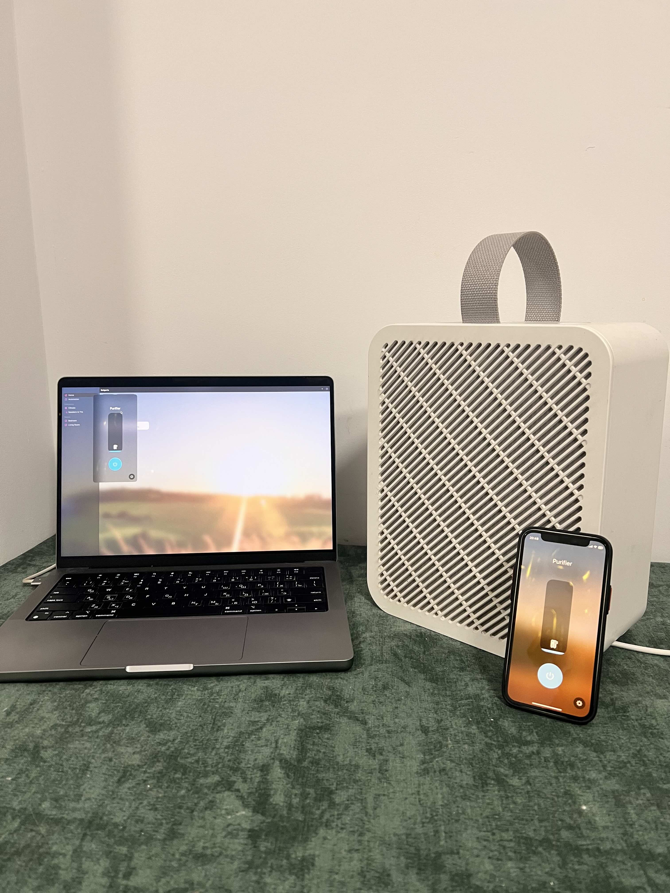

# HomeSpan IKEA UPPÅTVIND

Apple home-compatible ESP32 retrofit controller for the **IKEA UPPÅTVIND** air purifier.
This project not replaces the original control logic with a **HomeSpan-based ESP32**, it integrates directly with original board, and add *
*Apple Home (HomeKit via HomeSpan lib)** — while keeping the original purifier electronics fully functional.

The board simply attaches to the existing control PCB using four wires:

* Reads the LED signal (to detect current power/speed level)
* Simulates the button press (to toggle power levels)
* Controls the fan via PWM frequency

---

## ✨ Features

* Native **Apple Home** integration (via HomeSpan)
* **Reads the purifier’s LED signal** (PWM duty cycle) to detect active mode (Off / Low / Medium / High)
* **Simulates button press** for mode cycling (power & speed)
* **Controls fan speed** via PWM frequency output
* Automatically synchronizes state changes between:

    * Physical button presses
    * Home app commands
* On-board LED heartbeat (blinks to indicate activity or running state)
* Simple configuration — Wi-Fi credentials are set directly in code
* No web interface or cloud dependency

---

## ⚙️ Hardware Setup

### Wiring Diagram

Below is the basic wiring setup between the ESP32 dev board and the purifier control board.

```
+----------------------------------+
|        IKEA UPPÅTVIND PCB        |
|                                  |
|  [SIGNAL_PIN] ----- TP7          |
|  [EMULATEPIN] -------- TP4       |
|  [PWMPIN] - WIRE Black to fan    |
|  [GND] ----------- TP2           |
|  [VIN] ----------- TP3           |
+----------------------------------+
             |
             v
+----------------------------------+
|            ESP32 Dev Board        |
|                                  |
|  SIGNAL_PIN   = GPIO 35 (Input)  |
|  EMULATEPIN   = GPIO 25 (Output) |
|  PWMPIN       = GPIO 18 (PWM Out)|
|  LED_PIN      = GPIO 2  (Status) |
|  GND          = Common Ground    |
|  VIN          = +5v              |
+----------------------------------+
```

---

### Pin Summary

| Function              | ESP32 Pin | Direction | Description                              |
|-----------------------|-----------|-----------|------------------------------------------|
| **LED Signal Input**  | GPIO 35   | Input     | Reads LED PWM to determine current speed |
| **Button Emulation**  | GPIO 25   | Output    | Simulates a physical button press        |
| **Fan Control (PWM)** | GPIO 18   | Output    | Controls fan power by PWM frequency      |
| **Status LED**        | GPIO 2    | Output    | Indicates board is alive / operational   |
| **Ground**            | GND       | Common    | Shared reference with purifier board     |
| **+5v**               | VIN       | Input     | Get power for ESP32 board                |

### Button

The main button the UPPÅTVIND is active-low switch. It's schematic is like:

```
               S1
              _|_
U1--R1--TP4--o   o--GND
         |
         |
       ESP32
```

### LED

The main LED (LED1) of the UPPÅTVIND has 4 states, off, and low, medium, and high brightnesses. The PWM is used to
control the brightness.

The LED has similar wiring but instead of the ESP32 using an output ping, the it'll uses an input pin connected to TP7.
The ESP32 can then measure the pulse width to sense the LED brightness.

```
U1--TP7--LED1--GND
     |
     |
   ESP32
```

| UPPÅTVIND | Wemos D1 | Notes                                                      |
|-----------|----------|------------------------------------------------------------|
| TP2       | GND      |
| TP3       | 5V       |
| TP4       | D5       | TP4 is between the button switch at S1 and the UPPÅTVIND   |
| TP7       | D6       | TP7 is between anode (positive) side of LED1 the UPPÅTVIND |


Board connections

- Power up ESP32 board: TP3 AND TP32 (TP3 is +5v, TP2 is GND)
- Button imitate press: TP4
- LED check state: TP7

---

## 🧠 Behavior

* When the **physical button** on the purifier is pressed, the ESP32 detects the change in LED PWM signal and updates
  its internal state.
* When the **Home app** changes the purifier state (On/Off or speed), the ESP32:

    * If purifier is off → simulates one physical press to power it on.
    * Adjusts the PWM output frequency to match the desired speed.
* LED signal analysis is based on **PWM high/low timing** to infer brightness and thus speed mode.
* The **on-board LED** (GPIO 2) blinks periodically to confirm operation or watchdog activity.

---

## 📦 Installation

1. **Clone the repository**

   ```bash
   git clone https://github.com/mrSerg/homespan-ikea-uppatvind.git
   cd homespan-ikea-uppatvind
   ```

2. **Open in Arduino IDE / PlatformIO**

    * Install the [HomeSpan](https://github.com/HomeSpan/HomeSpan) library.
    * Select the correct board: **ESP32 Dev Module**.
    * Configure your Wi-Fi credentials inside the source code:

      ```cpp
      homeSpan.setWiFiCredentials("YourWiFiName", "YourWiFiPassword");
      ```

3. **Flash the firmware**

    * Connect the ESP32 to your computer via USB.
    * Upload the sketch.
    * Open the serial monitor (115200 baud) to verify connection.

4. **Pair with Apple Home**

    * When powered for the first time, the device will advertise itself as a new Matter accessory.
    * Add it in the **Apple Home app** using the pairing code displayed in the serial log.
    * After setup, the device will automatically reconnect after reboot.

---

## ⚡ How It Works

| Component       | Function                                                              |
|-----------------|-----------------------------------------------------------------------|
| **LED Signal**  | Provides PWM waveform representing purifier speed (OFF/LOW/MED/HIGH). |
| **PWM Control** | ESP32 outputs PWM with frequency mapping to speed levels (75–320 Hz). |
| **Button Sim.** | Digital pulse (~100 ms) emulates the purifier’s tactile button press. |
| **Watchdog**    | Ensures ESP32 reboots if the firmware becomes unresponsive.           |
| **HomeSpan**    | Handles Matter / Apple Home pairing and state synchronization.        |

---

## 📷 Media





---

## Demo videos

- [Demo Video 1](assets/IMG_7655-1.mp4)
- [Demo Video 2](assets/IMG_7655-2.mp4)
- [Demo Video 3 (yes, accent is bad, i know)](assets/IMG_7659.mp4)

---

## 🧬 Known Limitations

* Wi-Fi credentials are hardcoded — no web UI for configuration.
* Only supports four discrete fan levels (OFF / 1 / 2 / 3).
* PWM frequency mapping may vary slightly depending on fan hardware tolerance.
* Requires shared GND with purifier control board.

---

## 🪪 License

This project is licensed under the [MIT License](LICENSE).

---

## 💡 Credits

Inspired by

[jonathonlui/esphome-ikea-uppatvind](https://github.com/jonathonlui/esphome-ikea-uppatvind)

[maxmacstn/ESP32-IKEA-UPPATVIND](https://github.com/maxmacstn/ESP32-IKEA-UPPATVIND)

[horvathgergo/esp8266-for-uppatvind](https://github.com/horvathgergo/esp8266-for-uppatvind)

Adapted and extended with **HomeSpan Matter integration**

---

## Tags for search

- IKEA apple home
- Uppatvind smart
- Uppatvind apple
- Purifier ikea apple home
- Add Uppatvind to apple home
- Uppatvind Apple homekit